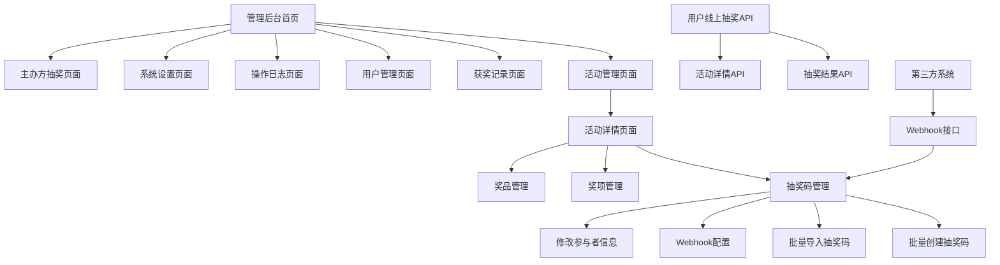

# 抽奖系统产品需求文档

## 1. 产品概述

一个支持多种抽奖模式的完整抽奖系统，包含管理后台和API接口，采用前后端分离架构。
系统支持主办方线下抽奖（需鉴权）和用户线上抽奖（无需鉴权）两种模式，提供完整的活动管理、奖项设置和抽奖码管理功能。
抽奖以抽奖码为核心，参与者信息作为可选的附加信息。支持多种抽奖码格式和Webhook接口，为各类活动提供便捷、公平、可管理的抽奖解决方案。

## 2. 核心功能

### 2.1 用户角色

| 角色    | 注册方式       | 核心权限                      |
| ----- | ---------- | ------------------------- |
| 超级管理员 | 系统初始化时设置   | 创建管理员账户、系统配置、查看所有操作日志     |
| 管理员   | 超级管理员创建或注册 | 创建和管理活动、设置奖项、管理抽奖码、查看获奖记录 |
| 参与者   | 无需注册       | 使用抽奖码参与抽奖、查看中奖记录          |

### 2.2 功能模块

我们的抽奖系统需求包含以下主要页面：

1. **管理后台首页**：活动概览、数据统计面板
2. **活动管理页面**：创建活动、编辑活动信息、删除活动、设置抽奖模式
3. **活动详情页面**：单个活动的抽奖码、奖项、奖品管理
4. **获奖记录页面**：查看中奖记录、导出获奖名单
5. **用户管理页面**：管理员账户管理、权限设置
6. **操作日志页面**：查看系统操作日志、审计记录
7. **系统设置页面**：系统配置、数据库管理
8. **主办方抽奖页面**：管理员登录后的线下抽奖操作界面

### 2.3 页面详情

| 页面名称    | 模块名称   | 功能描述                        |
| ------- | ------ | --------------------------- |
| 管理后台首页  | 数据统计面板 | 显示活动总数、抽奖码数量、中奖统计等关键指标       |
| 管理后台首页  | 活动概览   | 展示最近活动列表、快速操作入口             |
| 活动管理页面  | 活动列表   | 显示所有活动、支持搜索筛选、状态管理          |
| 活动管理页面  | 活动表单   | 创建和编辑活动基本信息（名称、描述、时间、抽奖模式、抽奖码格式等） |
| 活动详情页面  | 抽奖码管理  | 显示活动抽奖码信息、使用状态、批量导入、Webhook接口        |
| 活动详情页面  | 奖项管理   | 添加奖项、设置奖品名称、数量、中奖概率         |
| 活动详情页面  | 奖品管理   | 管理奖品库存、奖品信息、发放状态            |
| 获奖记录页面  | 中奖记录   | 显示所有中奖记录、支持按活动筛选            |
| 获奖记录页面  | 数据导出   | 导出获奖名单为Excel格式              |
| 用户管理页面  | 管理员列表  | 显示所有管理员账户、权限管理              |
| 用户管理页面  | 账户操作   | 创建、编辑、删除管理员账户               |
| 操作日志页面  | 日志列表   | 显示系统操作日志、支持筛选和搜索            |
| 操作日志页面  | 日志详情   | 查看详细的操作记录和审计信息              |
| 系统设置页面  | 数据库管理  | 数据库初始化、备份恢复功能               |
| 系统设置页面  | 系统配置   | 系统参数设置、安全配置                 |
| 主办方抽奖页面 | 抽奖界面   | 管理员登录后输入抽奖码、执行抽奖逻辑、显示结果     |
| 主办方抽奖页面 | 活动选择   | 选择当前进行抽奖的活动、查看活动信息          |

## 3. 核心流程

**系统初始化流程：**
首次启动 → 数据库初始化 → 创建超级管理员 → 系统配置完成

**管理员流程：**
管理员登录后台 → 创建活动并设置抽奖模式和抽奖码格式 → 进入活动详情 → 设置奖项和奖品 → 批量创建或导入抽奖码 → 配置Webhook接口（可选） → 监控抽奖过程 → 查看获奖记录 → 导出获奖名单

**主办方线下抽奖流程：**
管理员登录 → 选择活动 → 输入抽奖码 → 执行抽奖（需鉴权） → 查看结果

**用户线上抽奖流程：**
用户获取抽奖码 → 访问抽奖API → 输入抽奖码 → 执行抽奖（无需鉴权） → 获取结果

**Webhook流程：**
第三方系统 → 调用Webhook接口 → 添加抽奖码和参与者信息 → 抽奖码可用于抽奖

**多账户管理流程：**
超级管理员创建管理员账户 → 分配权限 → 管理员独立管理活动 → 操作日志记录



## 4. 用户界面设计

### 4.1 设计风格

* 主色调：蓝色系（#3B82F6）和绿色系（#10B981）

* 辅助色：灰色系（#6B7280）和红色系（#EF4444）

* 按钮样式：圆角按钮，支持悬停和点击效果

* 字体：系统默认字体，标题16-24px，正文14-16px

* 布局风格：基于shadcn-vue blocks的现代化布局，包含导航栏和侧边栏

* 图标风格：线性图标，支持彩色状态图标

* 响应式设计：移动端优先，支持触摸操作

### 4.2 页面设计概览

| 页面名称    | 模块名称   | UI元素                        |
| ------- | ------ | --------------------------- |
| 管理后台首页  | 数据统计面板 | 卡片式统计组件，使用蓝色主题，包含图表和数字展示    |
| 管理后台首页  | 活动概览   | 表格组件，支持分页和搜索，操作按钮使用主色调      |
| 活动管理页面  | 活动表单   | 表单组件，使用栅格布局，抽奖模式选择器，输入框圆角设计 |
| 奖项管理页面  | 奖项设置   | 模态框表单，拖拽排序功能，概率设置使用滑块组件     |
| 参与者管理页面 | 批量导入   | 文件上传组件，进度条显示，支持拖拽上传         |
| 获奖记录页面  | 数据导出   | 按钮组件，下载图标，支持多种格式选择          |
| 主办方抽奖页面 | 抽奖界面   | 大按钮设计，活动选择下拉框，抽奖码输入框，结果显示区域 |

### 4.3 响应式设计

系统采用移动端优先的响应式设计，基于shadcn-vue blocks框架构建。管理后台支持桌面端和移动端操作，提供触摸友好的交互体验，侧边栏在移动端可折叠显示。

## 5. 技术规范

### 5.1 前端技术栈

* **框架**：Vue 3 + TypeScript

* **构建工具**：Vite + Rolldown

* **样式**：TailwindCSS 原子化CSS

* **UI组件**：shadcn-vue，使用blocks部分的基础框架

* **路由**：Vue Router 4

* **状态管理**：Pinia

### 5.2 后端技术栈

* **运行环境**：Node.js 18+

* **框架**：Express.js

* **数据库**：MySQL 8.0+

* **ORM**：Sequelize 或 Prisma

* **身份验证**：JWT

* **日志记录**：Winston

### 5.3 系统功能

#### 5.3.1 数据库初始化

* 首次启动时自动检测数据库连接

* 运行数据表创建脚本

* 命令行交互式设置超级管理员账户

* 初始化系统配置参数

#### 5.3.2 操作日志系统

* 记录所有管理员操作行为

* 包含操作时间、用户、操作类型、详细内容

* 支持日志查询、筛选和导出

* 敏感操作（删除、修改）重点记录

#### 5.3.3 多账户管理

* 超级管理员可创建普通管理员

* 支持账户启用/禁用状态管理

* 密码安全策略（复杂度要求、定期更换）

* 登录会话管理和超时控制

#### 5.3.4 活动数据隔离

* 每个活动独立管理参与者数据

* 每个活动独立管理奖项和奖品

* 支持活动间数据复制和模板功能

* 活动删除时的数据清理机制

## 6. API接口设计

### 6.1 统一抽奖接口

**接口地址：** `POST /api/lottery/draw`

**请求参数：**

```json
{
  "activityId": "活动ID",
  "lotteryCode": "抽奖码",
  "authorization": "可选，主办方线下抽奖时需要提供管理员token"
}
```

**响应数据：**

```json
{
  "success": true,
  "data": {
    "prizeId": "奖项ID",
    "prizeName": "奖品名称",
    "isWin": true,
    "drawTime": "抽奖时间"
  },
  "message": "抽奖成功"
}
```

### 6.2 用户前台接口

* `GET /api/activity/{id}` - 获取活动详情

* `GET /api/lottery/history/{code}` - 查询抽奖码历史记录

### 6.3 管理后台接口

#### 6.3.1 活动管理接口

* `GET /api/admin/activities` - 获取活动列表

* `POST /api/admin/activities` - 创建活动

* `PUT /api/admin/activities/:id` - 更新活动信息

* `DELETE /api/admin/activities/:id` - 删除活动

* `GET /api/admin/activities/:id/lottery-codes` - 获取活动抽奖码

* `POST /api/admin/activities/:id/lottery-codes` - 添加抽奖码

* `POST /api/admin/activities/:id/lottery-codes/batch` - 批量创建抽奖码

* `POST /api/admin/activities/:id/lottery-codes/import` - 批量导入抽奖码

* `PUT /api/admin/activities/:id/lottery-codes/:code/invalidate` - 作废抽奖码

* `PUT /api/admin/activities/:id/lottery-codes/batch-invalidate` - 批量作废抽奖码

* `PUT /api/admin/lottery-codes/:id/participant-info` - 修改抽奖码参与者信息

* `GET /api/admin/activities/:id/webhook-info` - 获取Webhook接口信息

* `POST /api/admin/activities/:id/prizes` - 添加奖项

* `PUT /api/admin/prizes/:id` - 更新奖项信息

* `DELETE /api/admin/prizes/:id` - 删除奖项

#### 6.3.2 获奖记录接口

* `GET /api/admin/lottery/records` - 获取中奖记录

* `POST /api/admin/lottery/export` - 导出获奖名单

### 6.4 新增管理接口

#### 6.4.1 用户管理接口

* `POST /api/admin/users` - 创建管理员账户

* `GET /api/admin/users` - 获取管理员列表

* `PUT /api/admin/users/:id` - 更新管理员信息

* `DELETE /api/admin/users/:id` - 删除管理员账户

* `PUT /api/admin/users/:id/status` - 启用/禁用账户

#### 6.4.2 操作日志接口

* `GET /api/admin/logs` - 获取操作日志列表

* `GET /api/admin/logs/:id` - 获取日志详情

* `POST /api/admin/logs/export` - 导出日志数据

#### 6.4.3 系统管理接口

* `POST /api/system/init` - 系统初始化

* `GET /api/system/status` - 获取系统状态

* `POST /api/system/backup` - 数据库备份

* `POST /api/system/restore` - 数据库恢复

### 6.5 Webhook接口

* `POST /api/webhook/activities/:webhook_id/lottery-codes` - Webhook添加抽奖码接口

## 7. 数据库设计

### 7.1 核心数据表

#### 7.1.1 用户表 (users)

```sql
CREATE TABLE users (
  id INT PRIMARY KEY AUTO_INCREMENT,
  username VARCHAR(50) UNIQUE NOT NULL,
  password_hash VARCHAR(255) NOT NULL,
  email VARCHAR(100),
  role ENUM('super_admin', 'admin') DEFAULT 'admin',
  status ENUM('active', 'inactive') DEFAULT 'active',
  created_at TIMESTAMP DEFAULT CURRENT_TIMESTAMP,
  updated_at TIMESTAMP DEFAULT CURRENT_TIMESTAMP ON UPDATE CURRENT_TIMESTAMP
);
```

#### 7.1.2 操作日志表 (operation\_logs)

```sql
CREATE TABLE operation_logs (
  id INT PRIMARY KEY AUTO_INCREMENT,
  user_id INT,
  operation_type VARCHAR(50) NOT NULL,
  operation_detail TEXT,
  target_type VARCHAR(50),
  target_id INT,
  ip_address VARCHAR(45),
  user_agent TEXT,
  created_at TIMESTAMP DEFAULT CURRENT_TIMESTAMP,
  FOREIGN KEY (user_id) REFERENCES users(id)
);
```

### 7.2 更新的数据表

#### 7.2.1 活动表 (activities) - 更新

```sql
CREATE TABLE activities (
  id INT PRIMARY KEY AUTO_INCREMENT,
  name VARCHAR(100) NOT NULL,
  description TEXT,
  lottery_mode ENUM('offline', 'online') NOT NULL,
  start_time DATETIME,
  end_time DATETIME,
  status ENUM('draft', 'active', 'ended') DEFAULT 'draft',
  settings JSON COMMENT '活动设置：max_lottery_codes, lottery_code_format, allow_duplicate_phone等',
  webhook_id VARCHAR(50) UNIQUE COMMENT 'Webhook唯一标识',
  webhook_token VARCHAR(255) COMMENT 'Webhook访问token',
  created_by INT,
  created_at TIMESTAMP DEFAULT CURRENT_TIMESTAMP,
  updated_at TIMESTAMP DEFAULT CURRENT_TIMESTAMP ON UPDATE CURRENT_TIMESTAMP,
  FOREIGN KEY (created_by) REFERENCES users(id)
);
```

#### 7.2.2 奖品表 (prizes) - 新增

```sql
CREATE TABLE prizes (
  id INT PRIMARY KEY AUTO_INCREMENT,
  activity_id INT NOT NULL,
  name VARCHAR(100) NOT NULL,
  description TEXT,
  total_quantity INT NOT NULL DEFAULT 0,
  remaining_quantity INT NOT NULL DEFAULT 0,
  probability DECIMAL(5,4) NOT NULL,
  sort_order INT DEFAULT 0,
  created_at TIMESTAMP DEFAULT CURRENT_TIMESTAMP,
  updated_at TIMESTAMP DEFAULT CURRENT_TIMESTAMP ON UPDATE CURRENT_TIMESTAMP,
  FOREIGN KEY (activity_id) REFERENCES activities(id) ON DELETE CASCADE
);
```

#### 7.2.3 抽奖码表 (lottery_codes) - 新增

```sql
CREATE TABLE lottery_codes (
  id INT PRIMARY KEY AUTO_INCREMENT,
  activity_id INT NOT NULL,
  code VARCHAR(50) NOT NULL,
  status ENUM('unused', 'used') DEFAULT 'unused',
  participant_info JSON COMMENT '参与者信息：name, phone, email等',
  used_at TIMESTAMP NULL,
  created_at TIMESTAMP DEFAULT CURRENT_TIMESTAMP,
  updated_at TIMESTAMP DEFAULT CURRENT_TIMESTAMP ON UPDATE CURRENT_TIMESTAMP,
  UNIQUE KEY unique_activity_code (activity_id, code),
  FOREIGN KEY (activity_id) REFERENCES activities(id) ON DELETE CASCADE
);
```

#### 7.2.4 抽奖记录表 (lottery_records) - 新增

```sql
CREATE TABLE lottery_records (
  id INT PRIMARY KEY AUTO_INCREMENT,
  activity_id INT NOT NULL,
  lottery_code_id INT NOT NULL,
  prize_id INT NULL,
  is_winner BOOLEAN DEFAULT FALSE,
  operator_id INT NULL COMMENT '线下抽奖时的操作员ID',
  ip_address VARCHAR(45),
  user_agent TEXT,
  created_at TIMESTAMP DEFAULT CURRENT_TIMESTAMP,
  FOREIGN KEY (activity_id) REFERENCES activities(id) ON DELETE CASCADE,
  FOREIGN KEY (lottery_code_id) REFERENCES lottery_codes(id) ON DELETE CASCADE,
  FOREIGN KEY (prize_id) REFERENCES prizes(id) ON DELETE SET NULL,
  FOREIGN KEY (operator_id) REFERENCES users(id) ON DELETE SET NULL
);
```

### 7.3 数据关系

* 用户表与活动表：一对多关系（一个用户可以创建多个活动）

* 活动表与奖品表：一对多关系（一个活动可以有多个奖品）

* 活动表与抽奖码表：一对多关系（一个活动可以有多个抽奖码）

* 抽奖码表与抽奖记录表：一对多关系（一个抽奖码可以有多次抽奖记录）

* 奖品表与抽奖记录表：一对多关系（一个奖品可以被多次中奖）

* 用户表与操作日志表：一对多关系（一个用户可以有多条操作记录）

* 用户表与抽奖记录表：一对多关系（一个管理员可以操作多次线下抽奖）

### 7.4 抽奖码格式说明

支持的抽奖码格式：

* `4_digit_number`: 4位纯数字（例如：1234）
* `8_digit_number`: 8位纯数字（例如：12345678）
* `8_digit_alphanumeric`: 8位数字+小写字母（例如：12a34b56）
* `12_digit_number`: 12位纯数字（例如：123456789012）
* `12_digit_alphanumeric`: 12位数字+字母（例如：12a34B56c78D）

### 7.5 Webhook机制

每个活动在创建时会自动生成：

* `webhook_id`: 活动的Webhook唯一标识
* `webhook_token`: 用于第三方系统调用的认证token

第三方系统可以通过以下接口添加抽奖码：
```
POST /api/webhook/activities/{webhook_id}/lottery-codes
Authorization: Bearer {webhook_token}
```

